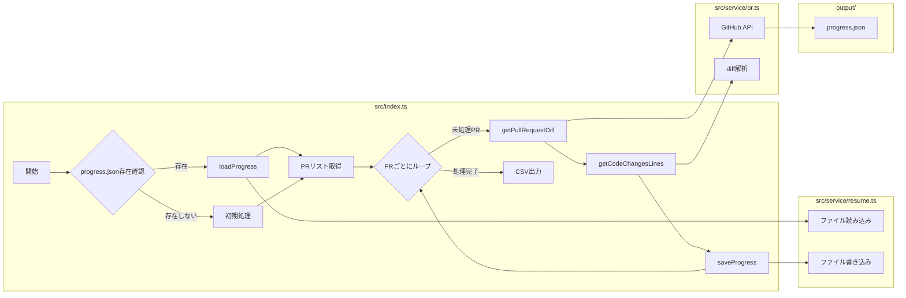

# 長時間実行プロセスのための再開機能 (Design Doc)

**著者:** Cline
**最終更新日:** 2025年3月2日

## 概要/背景

このドキュメントでは、`src/index.ts` スクリプトに再開機能を実装するための設計について説明します。
この機能により、多数のプルリクエストを処理するなど、長時間実行される操作において、中断が発生した場合でも最後に保存された状態から処理を再開できるようになります。
現状、スクリプトは処理を最初からやり直す必要があるため、中断が発生すると大きな時間のロスにつながります。

## 目標

この設計の主な目標は、`src/index.ts`スクリプトに再開機能を実装し、長時間の処理が中断された場合でも、途中から処理を再開できるようにすることです。具体的には、以下の目標を達成します。

1.  **中断からの復帰**: スクリプトが予期せず中断された場合（エラー、ネットワークの問題、ユーザーによる中断など）、最後に保存された状態から処理を再開できるようにします。
2.  **処理の効率化**: 既に処理済みのプルリクエストの情報を再利用することで、重複した処理を避け、全体の処理時間を短縮します。
3.  **データの保全性**: 中断が発生した場合でも、それまでに取得・処理したデータが失われないようにします。
4.  **ユーザーの利便性向上**: 長時間かかる処理を、ユーザーが安心して実行できるようにします。

## 機能要件

*   **ユーザーストーリー1**: ユーザーは、`src/index.ts`スクリプトを実行し、多数のGitHubプルリクエストの情報を取得・解析できる。
*   **ユーザーストーリー2**: スクリプトの実行中に中断が発生した場合、ユーザーはスクリプトを再実行すると、中断した箇所から処理を再開できる。
*   **ユーザーストーリー3**: ユーザーは、処理済みのプルリクエストと未処理のプルリクエストを区別できる。
*   **ユーザーストーリー4**: ユーザーは、各プルリクエストの基本的な情報（番号、タイトル、作成者、作成日時、マージ日時、URL）とdiff情報を確認できる。

## 非機能要件

*   **パフォーマンス**: 各プルリクエストのdiff取得と解析は、平均して10秒以内に完了すること。
*   **スケーラビリティ**: スクリプトは、少なくとも1000件のプルリクエストを処理できること。
*   **信頼性**: 進捗情報は、ファイルシステムに永続的に保存され、スクリプトのクラッシュやシステムの再起動後も保持されること。
*   **保守性**: 再開機能のロジックは、`src/service/resume.ts`にカプセル化され、他の部分との結合度が低いこと。

## 提案する設計

### アーキテクチャ図



### コンポーネント

*   **`src/index.ts`**: スクリプトのエントリーポイント。再開ロジック、PRリストの取得、PRごとの処理、CSV出力などを担当。
*   **`src/service/pr.ts`**: GitHub APIとの通信、diffの取得、diffの解析などを担当。
*   **`src/service/resume.ts`**: 再開機能のコアロジック（進捗の読み込み・保存）を担当。
*   **`output/progress.json`**: 中間状態を保存するJSONファイル。

### インターフェース

*   **`loadProgress` (in `src/service/resume.ts`)**:
    *   入力: なし
    *   出力: `progress.json` の内容を表すオブジェクト (`pullRequests` 配列を含む)。失敗時は `null` または空のオブジェクト (`{ pullRequests: [] }`)。
*   **`saveProgress` (in `src/service/resume.ts`)**:
    *   入力: `progress.json` に保存するデータ (`pullRequests` 配列を含むオブジェクト)。
    *   出力: なし (void)。

### データ構造

```json
{
  "pullRequests": [
    {
      "number": 123,
      "owner": "owner1",
      "repo": "repo1",
      "title": "PR Title 1",
      "created_at": "...",
      "merged_at": "...",
      "user": { ... },
      "html_url": "...",
      "diff": {
        "additions": 10,
        "deletions": 5,
        "files": { ... }
      },
      "processed": true
    },
    {
      "number": 124,
      "owner": "owner1",
      "repo": "repo1",
      "title": "PR Title 2",
      "created_at": "...",
      "merged_at": null,
      "user": { ... },
      "html_url": "...",
      "diff": null,
      "processed": false
    }
  ]
}
```

### アルゴリズム

1.  **起動時のチェック:** `output/progress.json` の存在を確認します。
2.  **ファイルが見つかった場合:**
    *   JSON データを読み込みます。
    *   `pullRequests` 配列を反復処理し、`processed` が `false` の PR から処理を再開します。
3.  **ファイルが見つからない場合:** 最初から処理を開始します。
4.  **定期的な保存:** 各 PR の diff 取得と解析が完了した後、`pullRequests` 配列の対応する PR の情報を更新し、`processed` フラグを `true` に設定します。そして、`progress.json` を上書きします。

## 代替案

*   **データベースの使用**: 進捗情報を保存するために、SQLiteなどの軽量データベースを使用することも検討しました。しかし、今回の要件ではファイルシステムで十分であると判断しました。データベースを使用すると、セットアップや依存関係の管理が複雑になる可能性があります。

## 未解決の問題

*   **エラーハンドリング**: GitHub APIからのエラーや、ファイル書き込みエラーが発生した場合の処理を、より詳細に検討する必要があります。
*   **進捗情報の詳細度**: 現在はPR単位で進捗を管理していますが、ファイル単位やdiffの行単位でより詳細な進捗管理を行うことも可能です。今後の要件に応じて検討します。

## 変更ファイル

| ファイルパス             | 変更内容の概要                                                                                                                                | 変更理由                                                                                                                               |
| :----------------------- | :---------------------------------------------------------------------------------------------------------------------------------------- | :------------------------------------------------------------------------------------------------------------------------------------- |
| `src/index.ts`           | 再開ロジックの追加、`loadProgress`、`saveProgress`の呼び出しの追加、PRリスト取得方法の変更、エラーハンドリングの強化                                                                | 再開機能の実装、処理の効率化、信頼性の向上                                                                                                       |
| `src/service/pr.ts`      | `getOpenPullRequests`関数の戻り値の変更 (PRのリストを返すように変更)、`getPullRequestDiff`関数の呼び出し箇所の変更                                                               | `src/index.ts`での再開ロジックの実装に合わせて、PR取得とdiff取得の責務を分離                                                                                 |
| `src/service/resume.ts` | `loadProgress`関数と`saveProgress`関数の実装                                                                                                    | 再開機能のコアロジックをカプセル化し、`src/index.ts`との結合度を下げる                                                                                       |
| `output/progress.json`  | (新規作成) 中間状態を保存するためのJSONファイル                                                                                                      | 再開に必要な情報を永続化するため                                                                                                           |
